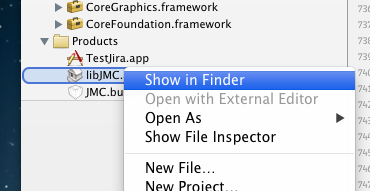
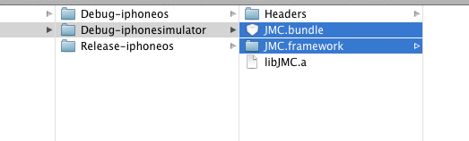

JMC-Mobile-Connect-framework
============================
This project encapsulate the jiraconnect-ios into a framework and resource bundle. This should save you time because now you can...

* Include the framework in a ARC enabled project without doing -fno-objc-arc
* Include the resource in one step, without find and select all the resource files.
* Feel good about your project, because it is nice and clean…

The original source is here: https://bitbucket.org/atlassian/jiraconnect-ios/overview, but  I wouldn't bother downloading it.


Steps to get the framework and resource
---------------------------------------

1. Clean and build "JMCFramework"


2. Right click on the libJMC.a and click "Show in Finder"


3. Go to the Debug-iphonesimulator for the fat build. Drag JMC.framework and JMC.bundle to your project


4. Usage ```#import <JMC/JMC.h>```

5. Bam!

6. Thank me! :)